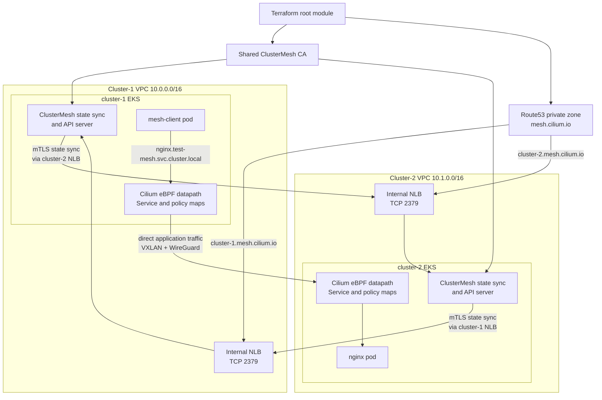

# Cilium ClusterMesh on Amazon EKS

This Terraform lab creates two EKS clusters connected with Cilium
ClusterMesh. It is intended to explore a different Kubernetes networking
model: pod addressing is decoupled from VPC addressing, service routing and
policy use an eBPF datapath rather than large iptables chains, traffic between
nodes is encrypted, and remote Service backends can be selected without a
sidecar in every application pod.

## Architecture



The diagram shows the deliberate split between the two runtime paths:

- **ClusterMesh control plane:** private DNS, internal NLBs, TCP/2379, and
  mutual TLS synchronize remote identities, nodes, and endpoints.
- **Application data plane:** Cilium's eBPF datapath sends ordinary service
  traffic directly between nodes through VXLAN and WireGuard. The NLB is never
  part of the application request path.

## Why Cilium

### Decouple pod capacity from VPC address capacity

The AWS VPC CNI normally assigns pod addresses from the VPC. That is simple,
but large or dense clusters can consume VPC secondary IP capacity quickly.

The configuration uses Cilium cluster-pool IPAM and VXLAN. Nodes keep their VPC
addresses, while pods use Cilium-managed ranges:

| Cluster | VPC CIDR | Pod CIDR |
| --- | --- | --- |
| `cluster-1` | `10.0.0.0/16` | `10.2.0.0/16` |
| `cluster-2` | `10.1.0.0/16` | `10.3.0.0/16` |

That means pod capacity can be planned independently of VPC secondary IP
capacity. It does not remove the need for network design: VPC, node, pod, and
service ranges must be unique and non-overlapping, and nodes in all connected
clusters must be able to reach each other.

### Move service routing and policy away from iptables

Kubernetes service routing and policy enforcement have traditionally relied
heavily on iptables. As the number of Services and endpoints grows, those
chains grow too and their update and debugging model becomes part of normal
operations.

Cilium attaches eBPF programs to the Linux datapath. With
`kubeProxyReplacement: true`, the configuration uses Cilium for Service
load-balancing, policy enforcement, and flow visibility instead of using
kube-proxy's iptables rules. eBPF is not a blanket performance guarantee for
every workload; it is an architectural change that removes iptables as the
primary dependency for these networking functions.

### Encrypt traffic and enforce policy by workload identity

The lab enables Cilium WireGuard node encryption. Cilium establishes encrypted
tunnels between known nodes; remote pod traffic is VXLAN-encapsulated and then
encrypted while crossing the VPC network.

Cilium also supplies one place to enforce Kubernetes and Cilium network policy
using workload identities and labels. Through ClusterMesh, that model extends
to remote endpoints in shared namespaces.

WireGuard protects traffic in transit between nodes. It is not application
mTLS and does not replace application-level authentication or authorization.

### Connect clusters without a per-workload sidecar

With a traditional sidecar mesh, each workload pod gets a local proxy that
intercepts traffic and receives destination information from the mesh control
plane. This is powerful, but it adds a proxy lifecycle, CPU and memory use,
an upgrade surface, and a troubleshooting hop to every application pod.

For L3/L4 traffic, Cilium performs service selection and routing in the eBPF
datapath on each node. ClusterMesh synchronizes remote nodes, identities,
endpoints, and Service backends, so the local node can select a remote pod
using the same Service lookup that it uses for a local pod.

```text
client pod in cluster-1
  -> nginx.test-mesh.svc.cluster.local
  -> Cilium Service lookup in eBPF
  -> a cluster-2 nginx endpoint
  -> VXLAN + WireGuard between nodes
  -> destination pod
```

This does not mean every L7 service-mesh feature is free. Cilium can use
Envoy-based proxies for HTTP, gRPC, DNS, Gateway API, and ingress features
that require L7 parsing. The distinction is that ordinary pod-to-pod and
Service traffic does not require a sidecar in every application pod.

### The precise comparison: Istio, Consul, and Cilium

The useful comparison is not “proxy versus no proxy.” These tools overlap, but
they start at different layers and make different default trade-offs:

| Concern | Istio | Consul service mesh | Cilium + ClusterMesh in this configuration |
| --- | --- | --- | --- |
| Primary role | A service mesh focused on secure, observable, and programmable service-to-service traffic. | Service discovery plus a service mesh that works across Kubernetes, VMs, and other runtimes. | A CNI and eBPF networking/security datapath; ClusterMesh extends its L3/L4 connectivity and Services across Kubernetes clusters. |
| Default data plane | Either an Envoy sidecar beside each workload or Istio Ambient: a per-node L4 `ztunnel` plus optional L7 waypoint proxies. | Usually an Envoy sidecar beside each service. Consul dataplane can remove client agents, but it still manages a local proxy for the workload. | The Cilium agent runs per node. Ordinary pod and Kubernetes Service traffic is handled by eBPF; no proxy is injected into application pods. |
| Traffic interception | Sidecar mode intercepts workload traffic through Envoy. Ambient moves the L4 hop to the node and adds a waypoint only for L7 needs. | Transparent proxy mode uses iptables to redirect inbound and outbound traffic through the sidecar Envoy. | With kube-proxy replacement, eBPF handles Service translation, load-balancing, and policy in the kernel datapath instead of kube-proxy iptables chains. |
| Where endpoint state lives | Istiod discovers services, creates xDS configuration, and dynamically programs the Envoy proxies. | The Consul catalog/control plane provides Envoy xDS configuration, including upstream discovery, certificates, intentions, and L7 settings. | Kubernetes state plus KVStoreMesh remote state is programmed into each node's Cilium agent and its eBPF Service/endpoint maps. |
| Who selects the backend | The local Envoy/ztunnel/waypoint, depending on Istio data-plane mode and feature used. | The local Envoy proxy chooses a healthy upstream backend. | The node eBPF datapath selects the local or remote pod backend for ordinary L3/L4 Service traffic. |
| mTLS and authorization | Workload mTLS, identities, and authorization are core mesh features. | Workload mTLS is core: Consul issues or integrates certificates and Envoy enforces service intentions. | The configuration enables WireGuard **node-to-node** encryption and Cilium network policy. It does not enable workload application mTLS. ClusterMesh etcd has separate mTLS. |
| L7 traffic management | Rich request-aware routing, retries, timeouts, fault injection, traffic splitting, and telemetry. | Envoy-based HTTP/gRPC routing, L7 intentions, timeouts, and traffic-management configuration. | Possible through Cilium's Envoy-based L7, Gateway API, and ingress features, but not supplied by ClusterMesh itself or enabled in this configuration. |
| Multi-cluster model | Multiple control-plane and topology models; proxies receive remote service configuration. | Cluster peering or WAN federation, usually with mesh gateways for cross-network service traffic. | Direct remote pod connectivity, cluster-aware policy, and global Service backend sharing after KVStoreMesh syncs state. |
| Main operational cost | Proxy resources and lifecycle per workload in sidecar mode; lower per-workload overhead in Ambient where L7 waypoints are selective. | Proxy resources and lifecycle per meshed workload, plus Consul control-plane/catalog operations. | Cilium agents and eBPF state per node. No per-workload proxy for the L3/L4 path; add proxies only where L7 features are needed. |

In **Istio sidecar mode and Consul**, a client-local proxy receives endpoint
and policy configuration, then makes the outbound routing and load-balancing
decision. In Cilium's normal L3/L4 path, the node's eBPF Service map makes
that decision using state that Cilium has already synchronized locally. The
application pod does not contain a proxy.

There are two important caveats:

1. Istio is no longer only a sidecar mesh. Its Ambient mode moves L4 handling
   to a per-node proxy and uses waypoint Envoys only where L7 functionality is
   needed. It narrows the operational gap, but it is still a proxy-based data
   plane rather than Cilium's eBPF Service datapath.
2. Cilium ClusterMesh is not a drop-in replacement for all Istio or Consul
   features. The configuration provides sidecarless L3/L4 connectivity,
   policy, WireGuard transport encryption, and cross-cluster service discovery.
   Application mTLS, request-level retries, weighted traffic shifting, circuit
   breaking, and advanced request-aware routing require Cilium L7 features or
   a dedicated mesh.

### Consolidate the network datapath

Cilium can provide the CNI, kube-proxy replacement, NetworkPolicy,
encryption, Service load-balancing, Hubble observability, Gateway API, and
multi-cluster connectivity. The goal is not to enable every feature by
default, but to avoid maintaining several overlapping datapaths in the
configuration.

## What the lab creates

| Area | Resources and responsibility |
| --- | --- |
| Clusters | Two EKS clusters, `cluster-1` and `cluster-2`, each in its own VPC |
| Pod network | Cilium cluster-pool IPAM, VXLAN, kube-proxy replacement, WireGuard, Hubble, and Gateway API |
| Underlay | VPC peering, routes, and node security-group rules for VXLAN, WireGuard, health checks, and ClusterMesh |
| Mesh control plane | A `clustermesh-apiserver` in each cluster and an internal instance-mode NLB on TCP/2379 |
| TLS and discovery | A shared lab CA and a Route53 private zone, `mesh.cilium.io`, associated with both VPCs |
| AWS integration | AWS Load Balancer Controller, EBS CSI, and Karpenter through EKS Blueprints |
| Demo | A global `nginx` Service and `mesh-client` pod in the `test-mesh` namespace |

The root Terraform module owns shared infrastructure: the lab CA, VPC
peering, routes, and private hosted zone. Both clusters are instances of the
reusable [`terraform/cluster`](terraform/cluster) module.

## How ClusterMesh works here

ClusterMesh has two separate traffic paths. Keeping them distinct is crucial.

### Control plane: synchronize remote cluster state

Before the mesh exists, one cluster cannot rely on the other cluster's pod
network. Each cluster exposes `clustermesh-apiserver` behind an internal NLB
that is reachable over the already-peered VPC node network.

```text
KVStoreMesh in cluster-1
  -> resolve cluster-2.mesh.cilium.io
  -> cluster-2 internal NLB, TCP/2379
  -> NodePort and Kubernetes Service
  -> cluster-2 clustermesh-apiserver / etcd
```

The NLB is TCP pass-through. Cilium's API server ends mutual TLS; the NLB does
not terminate it.

Private DNS is required because Cilium's serving certificate covers
`*.mesh.cilium.io`, while an AWS-generated `*.elb.amazonaws.com` NLB hostname
is not a certificate SAN. Route53 CNAME records provide stable,
certificate-valid peer names even when an NLB is recreated.

The NLB target group disables source-IP preservation. Otherwise, an initial
connection could try to return through a remote overlay path before the
reverse ClusterMesh state exists.

### Data plane: send application traffic between nodes

After KVStoreMesh synchronizes remote endpoint and identity information,
Cilium programs each node's eBPF maps. Application packets do not traverse the
NLB:

```text
client pod -> local node eBPF -> VXLAN -> WireGuard -> remote node eBPF -> nginx pod
```

The NLB exists only for ClusterMesh state synchronization, not application
load-balancing.

## Deploy

### Prerequisites

- Terraform 1.0 or later
- AWS CLI authenticated to the target AWS account
- AWS permissions for EKS, EC2/VPC, IAM, Route53, and EKS add-on resources
- `kubectl` for the optional post-deployment verification

The current Terraform provisions both clusters in **one AWS account**.
ClusterMesh can span accounts, but that requires separate AWS provider
credentials, requester/accepter VPC peering, routes in both accounts, and an
authorized cross-account association to the Route53 private zone.

### Apply everything

```sh
terraform -chdir=terraform init
terraform -chdir=terraform apply
```

Terraform creates the underlay, installs Cilium and its dependencies, creates
the ClusterMesh API Services, waits for the NLB hostnames, and creates the
private Route53 records. No separate bootstrap apply, manual NLB edit, Helm
post-renderer, or `kubectl patch` is required.

## Verify cross-cluster Service connectivity

Configure local contexts after the apply:

```sh
aws eks update-kubeconfig --region ap-south-1 --name cluster-1 --alias cluster-1
aws eks update-kubeconfig --region ap-south-1 --name cluster-2 --alias cluster-2
```

Both clusters define a Service named `nginx` in the global `test-mesh`
namespace. The Service is annotated as global, so Cilium shares backends
across clusters. It also uses `service.cilium.io/affinity: remote`; in this
two-cluster lab, `remote` means the peer cluster.

```sh
kubectl --context cluster-1 -n test-mesh exec mesh-client -- \
  curl -s http://nginx.test-mesh.svc.cluster.local
# served-by=cluster-2

kubectl --context cluster-2 -n test-mesh exec mesh-client -- \
  curl -s http://nginx.test-mesh.svc.cluster.local
# served-by=cluster-1
```

Verify that the ClusterMesh control plane has converged:

```sh
kubectl --context cluster-1 -n kube-system exec ds/cilium -- \
  cilium-dbg clustermesh status --wait
```

## Production considerations

- The example stores the shared ClusterMesh CA private key in Terraform state.
  Use an organization-controlled CA or AWS Private CA with cert-manager for
  production, and share trust roots rather than server or client private keys.
- Keep node, pod, and service ranges unique across all connected clusters.
- `remote` affinity is a two-cluster demonstration. Design locality, failure,
  and traffic-steering behavior deliberately in a larger topology.
- Review encryption mode, NetworkPolicies, IAM boundaries, observability, and
  availability requirements before using this repository as a template.

## Teardown

```sh
terraform -chdir=terraform destroy
```

## References

- [Cilium ClusterMesh overview](https://docs.cilium.io/en/stable/network/clustermesh/intro/)
- [Cilium ClusterMesh setup](https://docs.cilium.io/en/stable/network/clustermesh/setup/)
- [Cilium Global Services](https://docs.cilium.io/en/stable/network/clustermesh/global-services/)
- [Cilium transparent WireGuard encryption](https://docs.cilium.io/en/stable/security/network/encryption-wireguard/)
- [Cilium Service Mesh](https://docs.cilium.io/en/stable/network/servicemesh/)
- [Istio architecture](https://istio.io/latest/docs/ops/deployment/architecture/)
- [Istio sidecar and Ambient modes](https://istio.io/latest/docs/overview/dataplane-modes/)
- [Consul service mesh](https://developer.hashicorp.com/consul/docs/connect)
- [Consul transparent proxy](https://developer.hashicorp.com/consul/docs/connect/proxy/transparent-proxy)
- [Significant troubleshooting record](docs/TROUBLESHOOTING-LOG.md)
