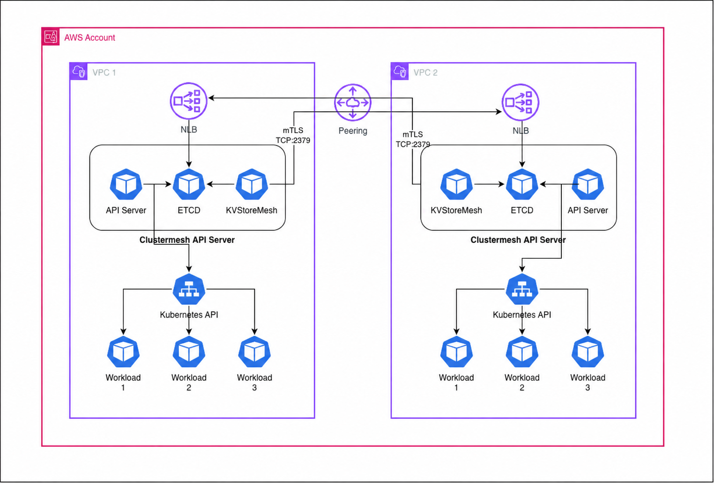

# Cilium ClusterMesh on Amazon EKS

## Overview

This Terraform lab connects two Amazon EKS clusters with Cilium ClusterMesh.
Each cluster has its own VPC and pod network. The demo runs an `nginx`
Service in both clusters; a client in either cluster can use the same
Kubernetes Service name to reach an `nginx` pod in the other cluster.

The lab explores four questions: how to give pods addresses without consuming
VPC IPs for every pod, how eBPF handles Kubernetes Service traffic, how
WireGuard encrypts traffic between nodes, and how ClusterMesh makes remote
pods and Services visible without a proxy in each application pod.

## What is Cilium?

Cilium is a Kubernetes networking system. It acts as the cluster's Container
Network Interface (CNI): the component that gives pods IP addresses and
connects them to other pods and Services. A `cilium-agent` runs on every
worker node and programs eBPF, which is code executed in the node's Linux
kernel. The agent sets up routing, Service load balancing, and network
policy; an application packet follows the programmed kernel rules without
going through the agent container for every request.

In this lab, Cilium is used for:

- **Pod addresses:** cluster-pool IP address management (IPAM) allocates pod
  IPs from ranges separate from the Amazon VPC subnets. A VPC is the private
  network that holds the worker nodes. Nodes still use VPC IPs. The VPC,
  pod, and Service ranges must remain unique and non-overlapping across the
  connected clusters.
- **Service routing and policy:** Cilium replaces kube-proxy's iptables
  Service path with eBPF lookup and load balancing. eBPF is also used for
  network policy and flow visibility.
- **Encryption:** WireGuard encrypts node-to-node traffic, including the
  cross-cluster pod traffic in this configuration. It protects transport
  between nodes; it does not provide application-level mTLS.
- **ClusterMesh:** Cilium shares the information needed to recognize remote
  pods and select remote Service backends. This primarily handles IP
  connectivity and TCP/UDP traffic (layers 3 and 4); features such as
  request retries and HTTP routing need application-layer components.

| Cluster | VPC CIDR | Pod CIDR |
| --- | --- | --- |
| `cluster-1` | `10.0.0.0/16` | `10.2.0.0/16` |
| `cluster-2` | `10.1.0.0/16` | `10.3.0.0/16` |

## Architecture



The picture shows the **state-sharing path**: each cluster exposes its
ClusterMesh etcd through an internal Network Load Balancer (NLB). The VPCs
are connected by peering so the clusters can reach each other's NLB and
worker nodes. The NLB carries ClusterMesh control traffic on TCP/2379.

There is a second path that is easier to miss in the picture: application
packets travel directly between worker nodes, through the Cilium datapath.
They do not pass through the ClusterMesh etcd or NLB. The arrows between the
Kubernetes API and workloads represent cluster state, not application packet
forwarding. The next section walks through both paths.

## ClusterMesh

ClusterMesh lets Cilium in one cluster learn about selected pods, identities,
nodes, and Services in another cluster. It has two stages: first share the
state, then use that state when forwarding packets.

### Flow 1: share state between clusters

Every cluster runs a `clustermesh-apiserver` pod with three containers. Here,
etcd is a small key-value database: it stores networking information as keys
and values that other Cilium components can watch for changes.

| Container | What it does |
| --- | --- |
| `apiserver` | Watches the local Kubernetes API and Cilium state, then publishes the local cluster's shareable state to its ClusterMesh etcd. |
| `etcd` | Stores the local state exposed to peers and the remote state cached by `kvstoremesh`. This is a separate, embedded etcd instance; it is **not** the etcd behind the EKS Kubernetes API. |
| `kvstoremesh` | Watches configured peer clusters' etcd instances and copies their shared state into the local etcd cache. |

When a new `nginx` pod starts in `cluster-2`, the sequence is:

1. Kubernetes records the pod and its endpoint information. Cilium learns
   about the pod in `cluster-2`.
2. The `apiserver` container in `cluster-2` watches the Kubernetes API and
   Cilium state and writes the information that can be shared to
   `cluster-2`'s embedded etcd. The Kubernetes API does not write directly
   to this etcd.
3. `cluster-1`'s `kvstoremesh` is already watching `cluster-2`'s etcd.
   Its connection goes through `cluster-2.mesh.cilium.io`, the internal
   NLB, and a NodePort on a worker node. Kubernetes forwards that NodePort
   traffic through the ClusterMesh Service to the etcd container in the
   `clustermesh-apiserver` pod.
4. `kvstoremesh` receives the new state and saves a local copy in
   `cluster-1`'s embedded etcd. `cluster-1`'s Cilium agents read that
   local copy and learn which remote node and pod can serve the request.

The connection between `kvstoremesh` and remote etcd is long-lived and uses
mutual TLS (mTLS). The NLB forwards TCP/2379; the etcd container handles the
TLS connection. The private Route 53 names match the certificate's
`*.mesh.cilium.io` name, whereas the AWS-generated NLB hostnames do not.
The NLB target group disables client IP preservation so its replies use the
node-network return path during mesh startup.

### Flow 2: send a request from one pod to another

Each local Cilium agent takes the endpoint information from Flow 1 and
programs Service and routing maps in its node's kernel. The application pods
never connect to etcd themselves.

In this demo, both clusters have a global `nginx` Service in the
`test-mesh` namespace. A **global Service** combines eligible local and
remote backends under the same Service name. The demo sets its affinity to
`remote`, so the peer cluster is selected:

1. The `mesh-client` pod in `cluster-1` requests
   `nginx.test-mesh.svc.cluster.local`. Kubernetes DNS returns its local
   Service IP.
2. The source node's Cilium eBPF Service map translates that virtual Service
   IP to an `nginx` pod IP in `cluster-2`. The map already contains the
   remote endpoint learned in Flow 1.
3. Cilium sends the packet across the worker-node network using VXLAN, which
   wraps the pod packet for transport between nodes, and WireGuard, which
   encrypts the node-to-node traffic. The VPC peering carries it to the
   destination node.
4. Cilium on the `cluster-2` node delivers the packet to the selected
   `nginx` pod. The reply follows the corresponding network path.

The pod request uses information obtained from etcd earlier; it does not
query etcd, Route 53, or the NLB for each request. The `cilium-agent`
programs the kernel maps, while the kernel handles the packets.

### What if there are 100 clusters?

In a **full mesh** of 100 clusters, each cluster's `kvstoremesh` connects to
the other 99 clusters and continuously watches their shared state. It keeps
a copy of that remote state in its own etcd. That is 9,900 directional
cluster-to-cluster relationships in total (`100 × 99`); the number of
individual etcd watch streams and TCP connections is an implementation
detail. Local Cilium agents use the local cache instead of each opening 99
remote connections.

A **partial mesh** configures each cluster with only the peers it needs.
That reduces the remote connections and the state copied into each cluster,
but a cluster can only use remote endpoints and Services from peers whose
state it receives. The network path for pod traffic must also exist between
those peers. This lab configures the two clusters as mutual peers.

Cilium supports up to 255 connected clusters by default, or 511 with a
smaller cluster-local identity space. The choice must be consistent across
the mesh and is difficult to change after installation. A 100-cluster
design should also consider how much endpoint and identity state is exported
and whether all clusters need to share one trust domain. See Cilium's
[architecture](https://docs.cilium.io/en/stable/network/clustermesh/intro/)
and [scaling guidance](https://docs.cilium.io/en/stable/network/clustermesh/setup/#scaling-limitations).

## Comparison

Istio, Consul, and Cilium overlap, but they solve different parts of the
service-to-service problem. This table describes the modes relevant to this
lab rather than every feature of each product.

| Question | Istio | Consul service mesh | Cilium and ClusterMesh in this lab |
| --- | --- | --- | --- |
| Where does routing happen? | An Envoy sidecar in sidecar mode; node-level `ztunnel` and optional waypoint proxies in Ambient mode. | Usually a local Envoy proxy beside each service. | The worker node's eBPF datapath selects a Service backend for ordinary L3/L4 traffic. |
| Where does destination information go? | Istiod distributes configuration to the proxies. | The Consul control plane distributes configuration to Envoy. | ClusterMesh copies remote state locally; Cilium agents program node eBPF maps. |
| Does each application pod need a proxy? | Yes in sidecar mode; no sidecar in Ambient mode. | Usually yes for transparent proxy mode. | No for the L3/L4 path in this lab. |
| What encryption is shown here? | Workload mTLS is a core feature. | Workload mTLS is a core feature. | WireGuard between nodes; separate mTLS protects ClusterMesh etcd. Application mTLS is not enabled. |
| What about HTTP-level features? | Rich HTTP routing, retries, and policy through proxies. | Envoy-based HTTP routing and policy. | Cilium can use Envoy for L7 features, but ClusterMesh alone does not supply these capabilities. |
| How are multiple clusters connected? | Various multicluster topologies and proxy routing models. | Cluster peering or federation, commonly with mesh gateways. | ClusterMesh shares endpoint state; this lab forwards pod traffic directly between nodes. |

The useful distinction for this experiment is **where a backend is chosen**.
With an Istio sidecar or a Consul proxy, the client-local proxy makes that
choice. With Cilium's standard L3/L4 Service path, the node's eBPF Service
map makes it from state that Cilium has already synchronized.

## What the lab creates

| Area | Resources and responsibility |
| --- | --- |
| Clusters | Two EKS clusters in separate VPCs within one AWS account |
| Pod network | Cilium cluster-pool IPAM, VXLAN, kube-proxy replacement, WireGuard, Hubble, Gateway API, and Ingress controller |
| Underlay | VPC peering, routes, and node security-group rules for ClusterMesh and node-to-node traffic |
| Mesh control plane | A `clustermesh-apiserver` in each cluster and an internal instance-mode NLB on TCP/2379 |
| TLS and discovery | A shared lab CA and a Route 53 private zone, `mesh.cilium.io`, associated with both VPCs |
| AWS integration | AWS Load Balancer Controller, EBS CSI, and Karpenter through EKS Blueprints |
| Demo | A global `nginx` Service and `mesh-client` pod in the `test-mesh` namespace in each cluster |

The root Terraform module owns the lab CA, VPC peering, routes, and private
hosted zone. Both clusters use the reusable
[`terraform/cluster`](terraform/cluster) module.
Additional, independently applied examples are documented in
[`demos/README.md`](demos/README.md).

## How to deploy

### Prerequisites

- Terraform 1.0 or later
- AWS CLI authenticated to the target AWS account
- AWS permissions for EKS, EC2/VPC, IAM, Route 53, and EKS add-ons
- `kubectl` for verification

The current Terraform provisions both clusters in **one AWS account**.
Cross-account deployment would need separate AWS provider credentials,
requester/accepter VPC peering, routes in both accounts, and cross-account
authorization for the Route 53 private-zone association.

### Apply

```sh
terraform -chdir=terraform init
terraform -chdir=terraform apply
```

Terraform creates the network, installs Cilium and its dependencies, creates
the ClusterMesh API Services, waits for the NLB hostnames, and creates the
private Route 53 records. It does not require a separate bootstrap apply,
manual NLB edit, Helm post-renderer, or `kubectl patch`.
The managed node groups and Cilium bootstrap together; CoreDNS, EBS CSI,
and the controller add-ons are installed after Cilium and the nodes are ready.

### Verify

Configure local Kubernetes contexts:

```sh
aws eks update-kubeconfig --region ap-south-1 --name cluster-1 --alias cluster-1
aws eks update-kubeconfig --region ap-south-1 --name cluster-2 --alias cluster-2
```

Check ClusterMesh convergence:

```sh
kubectl --context cluster-1 -n cilium exec ds/cilium -- \
  cilium-dbg clustermesh status --wait
```

Then request the same Service name from each cluster. Because the demo uses
`remote` affinity, each response should name the other cluster:

```sh
kubectl --context cluster-1 -n test-mesh exec mesh-client -- \
  curl -s http://nginx.test-mesh.svc.cluster.local
# served-by=cluster-2

kubectl --context cluster-2 -n test-mesh exec mesh-client -- \
  curl -s http://nginx.test-mesh.svc.cluster.local
# served-by=cluster-1
```

### Teardown

```sh
terraform -chdir=terraform destroy
```

## Production considerations

- The lab stores the shared ClusterMesh CA private key in Terraform state.
  Use an organization-controlled CA or private PKI for production, and
  distribute trust roots rather than sharing server or client private keys.
- Keep VPC, node, pod, and Service CIDRs unique across connected clusters.
- Design locality and failure behavior deliberately. The demo's `remote`
  affinity is useful for proving cross-cluster access, not a general routing
  policy for a large mesh.
- Review network policy, IAM boundaries, encryption settings, observability,
  and ClusterMesh availability before using this lab as a production template.
- Treat connected clusters as one trust domain: a compromised Cilium control
  plane in one cluster can affect state seen by its peers.

## References

- [Cilium overview](https://docs.cilium.io/en/stable/overview/intro/)
- [Cilium ClusterMesh architecture](https://docs.cilium.io/en/stable/network/clustermesh/intro/)
- [Cilium ClusterMesh setup and scaling](https://docs.cilium.io/en/stable/network/clustermesh/setup/)
- [Cilium Global Services](https://docs.cilium.io/en/stable/network/clustermesh/global-services/)
- [Cilium WireGuard encryption](https://docs.cilium.io/en/stable/security/network/encryption-wireguard/)
- [Cilium Service Mesh](https://docs.cilium.io/en/stable/network/servicemesh/)
- [Istio architecture](https://istio.io/latest/docs/ops/deployment/architecture/)
- [Istio sidecar and Ambient modes](https://istio.io/latest/docs/overview/dataplane-modes/)
- [Consul service mesh](https://developer.hashicorp.com/consul/docs/connect)
- [Consul transparent proxy](https://developer.hashicorp.com/consul/docs/connect/proxy/transparent-proxy)
- [Significant troubleshooting record](docs/TROUBLESHOOTING-LOG.md)
